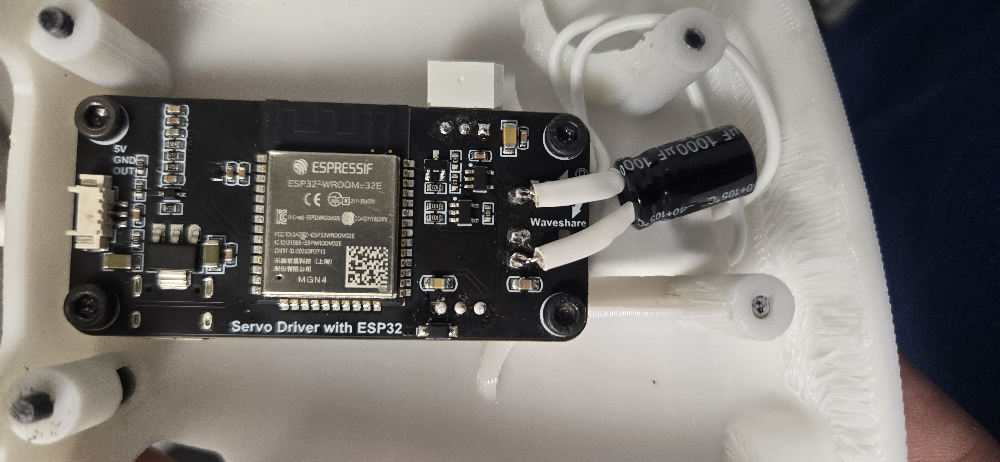
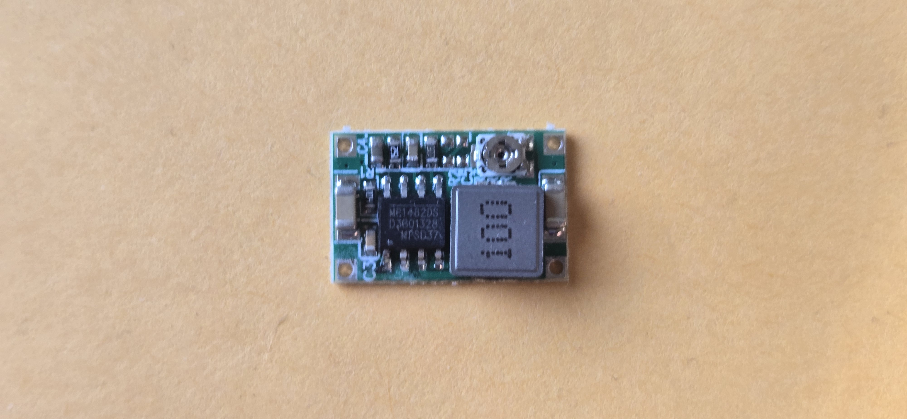
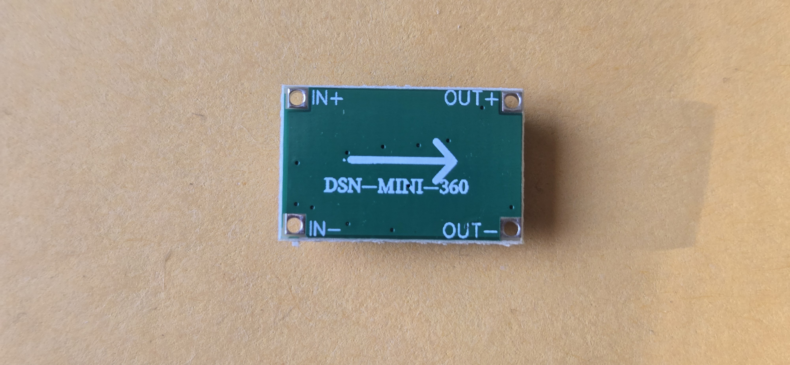
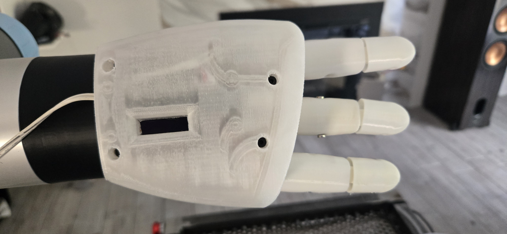
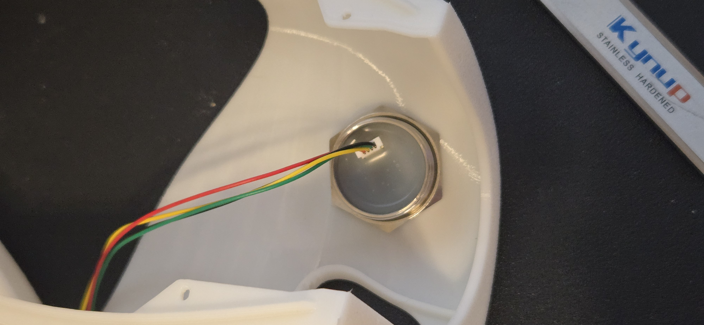
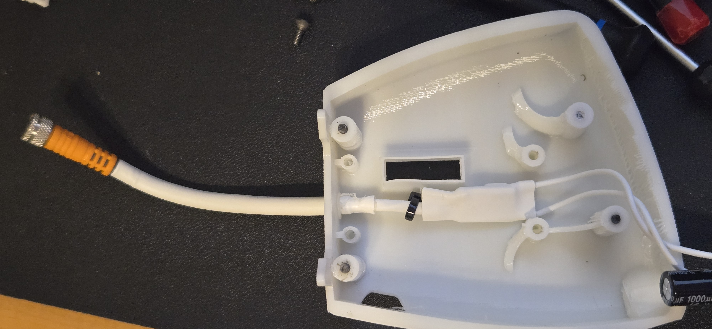
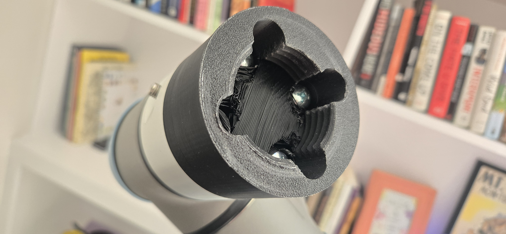

Project is licensed under [Apache 2.0](https://www.apache.org/licenses/LICENSE-2.0)


Mechanical design is licensed under a :
[Creative Commons Attribution 4.0 International License][cc-by].
[![CC BY 4.0][cc-by-image]][cc-by]
[![CC BY 4.0][cc-by-shield]][cc-by]

[cc-by]: http://creativecommons.org/licenses/by/4.0/
[cc-by-image]: https://licensebuttons.net/l/by/4.0/88x31.png
[cc-by-shield]: https://img.shields.io/badge/License-CC%20BY-lightgrey.svg


# Amazing Hand — UR5e / ESP32 Fork

> **This is a fork of the [original AmazingHand project](https://github.com/pollen-robotics/AmazingHand) by Pollen Robotics.**
> The primary purpose of this fork is to adapt the hand for use on a **Universal Robots UR5e** with an **onboard ESP32 controller**, cable-free power from the tool port, a palm-mounted barcode scanner, and a tool-less twist-off mount.
> All original build resources remain intact below.



# UR5e Integration (ESP32 Onboard Build)

This variant integrates the Amazing Hand directly onto a UR5e tool port with all electronics onboard — no external controller, no tether.

## Hardware Overview

### Controller: Waveshare ESP32 Servo Driver
The Waveshare ESP32 Servo Driver expansion board replaces the external serial bus driver. It mounts inside the hand housing and drives all 8 Feetech SCS0009 servos over the onboard TTL serial bus.

### Power: UR5e Tool Port + DSN-Mini-360 + 1000µF Cap
Power is sourced directly from the UR5e tool port (12V). A **DSN-Mini-360** DC-DC buck converter steps the voltage down to 5V for the servos and ESP32.




A **1000µF capacitor** is added on the output rail to absorb voltage spikes during servo load transients, protecting the ESP32 and servos.

### TCP Control over WiFi
The hand is controlled entirely over **TCP/IP**. The ESP32 either connects to the robot's WiFi SSID or creates its own access point. Commands are sent as newline-terminated ASCII strings:

```
J:<val0>,<val1>,...,<val7>,<speed>\n
```

Each `valN` is a float servo angle offset; `speed` is an integer (50–2000). The host connects to the ESP32 IP on port `8765` by default.

#### Example: `robot_face` ROS 2 Node
The [`robot_face`](src/robot_face/) package is a working example of TCP control. It uses MediaPipe hand tracking to stream live joint commands to the hand over a persistent TCP socket:

```python
# from src/robot_face/src/robot_face/combined_face_hand_node.py
self.hand_socket = socket.create_connection(
    (hand_host, hand_port),   # e.g. "192.168.1.194", 8765
    timeout=0.5,
)
self.hand_socket.sendall(hand_payload.encode("ascii"))
```

Commands are generated by `format_joint_command()` in [`hand_processing.py`](src/robot_face/src/robot_face/hand_processing.py) and streamed at a configurable rate (default 20 Hz).

### Sensor: GM60 UART Barcode Scanner (Palm-Mounted)
A **GM60 UART barcode scanner with integrated light ring** is embedded in the palm. The palm shell includes a cutout window aligned to the scanner aperture. The GM60 communicates over UART directly to the ESP32, enabling the hand to read barcodes or QR codes as part of a pick-and-place or identification workflow.





### UR5 Tool Mount with Tool-Less Disconnect
A custom 3D-printed **UR5 tool mount** attaches the hand to the UR5e flange. It features a **twist-on, tool-less disconnect** mechanism for fast hand swaps without any tools.



## Modified 3D Parts

The following parts were redesigned for this integration and are included in the [`cad/`](cad/) directory:

| Part | Description |
|------|-------------|
| Top Shell | Modified to fit ESP32 board and internal wiring |
| Palm Shell | Added GM60 barcode scanner window and cable routing |
| UR5 Mount | Tool-less twist-on adapter for UR5/UR5e flange |


---

# Amazing Hand project (original)


Robotic hands are often very expensive and not so expressive. More dexterous often needs cables and deported actuators in forearm i.e..

Aim of this project is to be able to explore humanoid hand possibilities on a real robot (and Reachy2 is the perfect candidate for that !) with moderate cost.
=> Wrist interface is designed for Reachy2's wrist (Orbita 3D), but it can be easily adapted to other robot's wrist...


Amazing Hand is :
- 8 dofs humanoid hand with 4 fingers
- 2 phalanxes per finger articulated together
- flexible shells allmost everywhere
- All actuators inside the hand, without any cables
- 3D printable
- 400g weight
- low-cost (<200€)
- open-source

[AmazingHand_Overview](/docs/AmazingHand_Overview.pdf)


Each finger is driven by parallel mechanism. 
That means 2x small Feetech SCS0009 servos are used to move each finger in flexion / extension & Abduction / Adduction


2 ways of control are available :
- Use a Serial bus driver (waveshare i.e.) + Python script
- Use an Arduino + feetech TTL Linker

Detailed explaination are available for both ways and Basic demo software is available also.
Up to you !


## Table of contents

- [Build Resources](#build-resources)
    - [BOM (Bill Of Materials)](#bom-bill-of-materials)
    - [CAD Files and Onshape document](#CAD-files-and-onshape-document)
    - [Assembly Guide](#assembly-guide)
    - [Run_basic_Demo](#Run-basic-Demo)
- [Disclaimer](#disclaimer)
- [AmazingHand_tracking Demo](#AmazingHand_tracking_Demo)
- [Project Updates & Community](#project-updates--community)
    - [Updates history](#updates-history)
    - [Project posts](#project-posts)
    - [To Do List](#to-do-list)
    - [FAQ](#faq)
    - [Contact](#contact)
    - [Thank you](#thank-you)


# Build Resources
## BOM (Bill Of Materials)
List of all needed components is available here:  
[AmazingHand BOM](https://docs.google.com/spreadsheets/d/1QH2ePseqXjAhkWdS9oBYAcHPrxaxkSRCgM_kOK0m52E/edit?gid=1269903342#gid=1269903342)  


And remember to add control choice cost (2 options detailed previously)


Detailed for custom 3D printed parts are here : 
[3Dprinted parts](https://docs.google.com/spreadsheets/d/1QH2ePseqXjAhkWdS9oBYAcHPrxaxkSRCgM_kOK0m52E/edit?gid=2050623549#gid=2050623549)


Here is guide to explain how to print all the needed custom parts :
[=> 3D Printing Guide](/docs/AmazingHand_3DprintingTips.pdf)
 


## CAD Files and Onshape document
STL and Steps files can be found [here](https://github.com/pollen-robotics/AmazingHand/tree/main/cad) 

Note that Fingers are the same if you want to build a left hand, but some parts are symetrical. Specific right hand parts are preceded by an "R", and other of the left hand parts by an "L".


Everyone can access the Onshape document too:   
[Link Onshape](https://cad.onshape.com/documents/430ff184cf3dd9557aaff2be/w/e3658b7152c139971d22c688/e/bd399bf1860732c6c6a2ee45?renderMode=0&uiState=6867fd3ef773466d059edf0c)  

Note that predefined position are available in "named position" tooling, with corresponding servos angles

  

## Assembly Guide

Assembly guide for the Amazing Hand in combination with standards components in the BOM is here :  
[=> Assembly Guide](/docs/AmazingHand_Assembly.pdf)  
  

You will need simple program / script to calibrate each fingers, available here :
- With Python & Waveshare serial bus driver : [here](https://github.com/pollen-robotics/AmazingHand/tree/main/PythonExample)
- With Arduino & TTLinker : [here](https://github.com/pollen-robotics/AmazingHand/tree/main/ArduinoExample)


Note that this assembly guide is for a standalone Right hand.

If you need to build a standalone Left hand, you can keep the sames IDs for servos location, and select if it's a right or left hand in the software.


## Run basic Demo

Basic Demo which is available with both Python & Arduino.

You will need external power supply to be able to power the 8 actuators inside the hand.

If you don't have one already, simple external power supply could be a DC/DC 220V -> 5V / 2A adapter with jack connector.
Check on the Bom List :
[AmazingHand BOM](https://docs.google.com/spreadsheets/d/1QH2ePseqXjAhkWdS9oBYAcHPrxaxkSRCgM_kOK0m52E/edit?gid=1269903342#gid=1269903342) 

- Python script : "AmazingHand_Demo.py" [here](https://github.com/pollen-robotics/AmazingHand/tree/main/ArduinoExample)
  
- Arduino program : "AmazingHand_Demo.ino" [here](https://github.com/pollen-robotics/AmazingHand/tree/main/PythonExample)


https://github.com/user-attachments/assets/485fc1f4-cc57-4e59-90b5-e84518b9fed0

## You need both right & left hands on the same bus ?

If you need to build both right and left hands to plug them on a robot, you will have to attribute differents IDs for right and left hands. You can't have same ID for different servos on the same serial bus...
Very important thing is to keep same assembly order for servos, but set them different IDs than for the right hand, as following :


Specific software is also needed, in order to drive each hand independently.
This simple demo runs same hand patterns on both hands simultaneously, but it's only available in python : 
"AmazingHand_Demo_Both" [here](https://github.com/pollen-robotics/AmazingHand/tree/main/PythonExample)

# Disclaimer

I noticed some variations between theorical angles for Flexion / Extension, Abduction / Adduction and angles in real life prototypes. This is probably due to several sources of variation (3D printed parts are not perfect, balljoint rods are manually adjusted one by one, esrvo horn rework, flexibility of plastic parts...).

This design has not yet bene tested for long and complex prehensive tasks. Before to be able to grasp objetcs safely (that means without damaging servos or mehanical parts), kind of smart software need to be build.
SCS0009 servos have smart capaibilities as:
- Torque enable / disable
- Torque feedback
- Current position sensor
- Heat temperature feedback
- ...


# AmazingHand advanced Demo
[](https://www.youtube.com/watch?v=U0TfeG3ZUto)

For more advanced usage using inverse/forward kinematics there are several examples in the [Demo](Demo) directory along with some useful tools to test/configure the motors.


# Project Updates & Community
## Updates from community

### Amazing Base for the amazing hand : 

STL or Step file can be found [here](https://github.com/pollen-robotics/AmazingHand/tree/main/cad) 

### Specific Chinese BOM available here :
[Chinese BOM](https://docs.google.com/spreadsheets/d/1fHZiTky79vyZwICj5UGP2c_RiuLLm89K8HrB3vpb2h4/edit?gid=837395814#gid=837395814)

Thanks to Jianliang Shen !

### You don't want to build it by yourself ? Kits are available visiting this link : 
https://shop.wowrobo.com/products/amazing-hand-the-open-source-robotic-hand-kit

## To Do List
- Design small custom pcb with serial hub and power supply functions, to fit everything in the hand
- Test with prehensive tasks 
      => Add smarter behaviour for closing hand, based on available motors feedbacks
- Study possibility to have 4 different fingers length, or add a 5th finger
- Study possibility to use STS3032 feetedch motors instead of SCS0009
      => Stronger for quite the same volume, but servo horn is different
- Study possibility to add compliancy by replacing rigid links to springs
- Add fingertip sensor to push one step higher smart control


## FAQ
WIP

## Contact

You can reach public discord channel here : 
[Discord AmazingHand](https://discord.com/channels/519098054377340948/1395021147346698300)

Or 
[Contact me or Pollen Robotics](/docs/contact.md)

## Thank you
Huge thanks to those who have contributed to this project so far:
- [Steve N'Guyen](https://github.com/SteveNguyen) for beta testing, Feetech motors integration in Rustypot, Mujoco/Mink and hand tracking demo
- [Pierre Rouanet](https://github.com/pierre-rouanet) for Feetech motors integration in pypot  
- [Augustin Crampette](https://fr.linkedin.com/in/augustin-crampette) & [Matthieu Lapeyre](https://www.linkedin.com/in/matthieulapeyre/) for open discussions and mechanical advices
